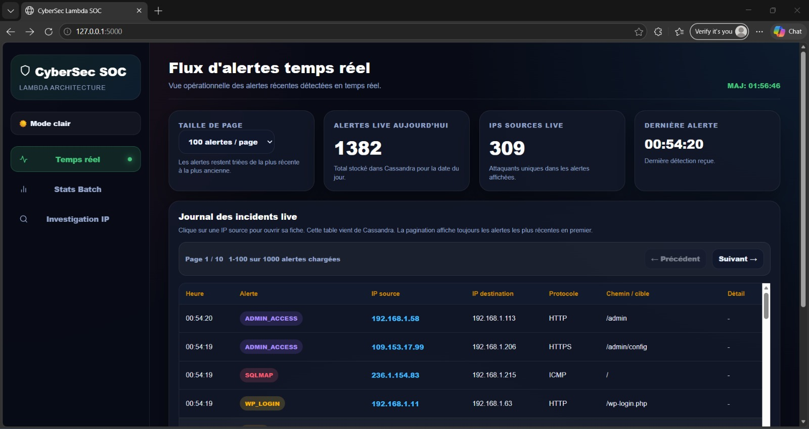
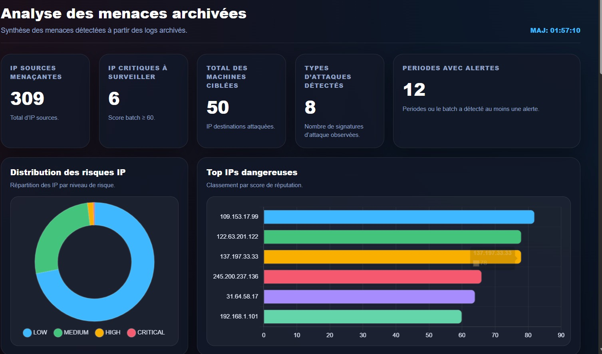
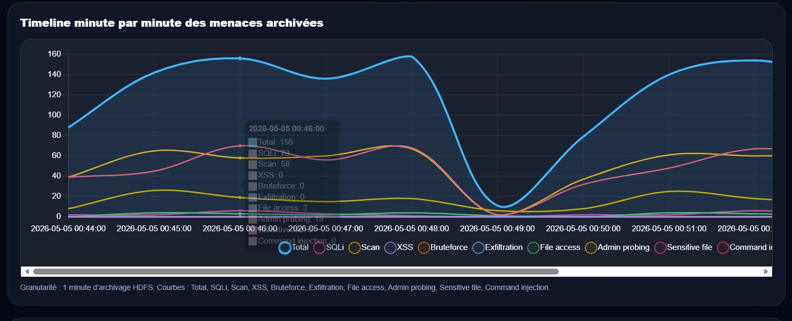
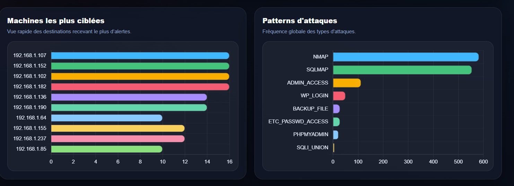
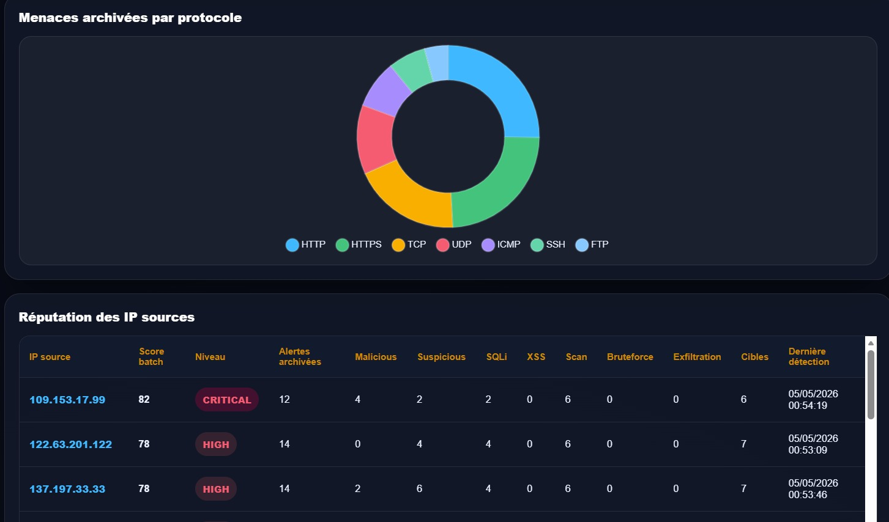
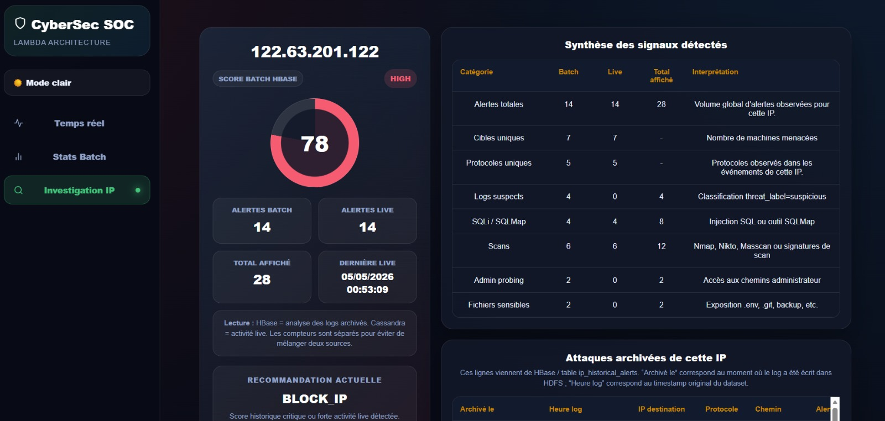

<div align="center">

# 🔐 BigData-CyberStream

### Real-Time Cybersecurity Threat Detection Pipeline

**Lambda Architecture • Kafka • Spark Streaming • HBase • Cassandra • Flask**

[](https://docs.docker.com/compose/)
[](https://spark.apache.org/)
[](https://kafka.apache.org/)
[](https://hbase.apache.org/)
[](https://cassandra.apache.org/)
[](https://flask.palletsprojects.com/)
[](https://python.org/)


</div>

---

> **Detect. Analyze. Respond.** — A distributed Big Data platform that ingests network logs in real time, identifies cyber threats through signature matching and behavioral analysis, and visualizes everything on a live SOC dashboard.

---

## 📑 Table of Contents

- [🧠 Overview](#-overview)
- [🏗️ Architecture](#️-architecture)
- [📸 Dashboard Screenshots](#-dashboard-screenshots)
- [⚡ Quick Start](#-quick-start)
- [📁 Project Structure](#-project-structure)
- [🔧 Prerequisites](#-prerequisites)
- [🚀 Running the Pipeline](#-running-the-pipeline)
- [🛑 Stopping & Resetting](#-stopping--resetting)
- [🔍 Detection Capabilities](#-detection-capabilities)
- [📊 Tech Stack](#-tech-stack)
- [🌐 Web UI Ports](#-web-ui-ports)
- [👥 Authors](#-authors)

---

## 🧠 Overview

This project implements a **Lambda Architecture** for cybersecurity threat detection. It combines two complementary processing layers:

| Layer | Purpose | Storage | Latency |
|-------|---------|---------|---------|
| **Speed Layer** | Real-time alert detection | Cassandra | ~1 sec |
| **Batch Layer** | Historical analytics & enrichment | HBase (via HDFS) | Periodic (configurable) |

The system analyzes network log events to detect a wide range of attack patterns including SQL injection, XSS, brute-force, network scanning, data exfiltration, path traversal, sensitive file access, and command injection. All detected threats are surfaced through a unified Flask dashboard with live alert feeds, historical analytics, risk scoring, and per-IP investigation views.

---

## 🏗️ Architecture

```
                           ┌─────────────────────┐
                           │   CSV Dataset Logs   │
                           └──────────┬──────────┘
                                      │
                                      ▼
                           ┌─────────────────────┐
                           │   Kafka Producer     │
                           │  (streaming/producer)│
                           └──────────┬──────────┘
                                      │
                                      ▼
                    ┌─────────────────────────────────┐
                    │     Kafka Topic                  │
                    │   cybersecurity-logs             │
                    └────────┬──────────────┬─────────┘
                             │              │
                 ┌───────────▼───┐   ┌──────▼──────────┐
                 │  Speed Layer  │   │   Batch Layer    │
                 │               │   │                  │
                 │ Spark Stream  │   │ Spark Stream     │
                 │  (streaming)  │   │  (archive_to_dfs)│
                 │      │        │   │       │          │
                 │      ▼        │   │       ▼          │
                 │  Cassandra    │   │     HDFS         │
                 │  (live alerts)│   │       │          │
                 │      │        │   │       ▼          │
                 │      ▼        │   │  Spark Batch     │
                 │  Dashboard    │   │   (batch_f)      │
                 │  (live feed)  │   │       │          │
                 └───────────────┘   │       ▼          │
                                     │     HBase        │
                                     │  (analytics)     │
                                     │       │          │
                                     │       ▼          │
                                     │   Dashboard      │
                                     │  (historical)    │
                                     └──────────────────┘
                                              │
                                     ┌────────▼─────────┐
                                     │   Flask + JS      │
                                     │   SOC Dashboard   │
                                     └──────────────────┘
```

**Data flow in a nutshell:**
1. The **Kafka Producer** reads network logs from a CSV dataset and publishes them to the `cybersecurity-logs` topic.
2. **Spark Streaming** (`streaming.py`) consumes the topic in real time, applies signature-based and behavioral detection rules, and writes live alerts to **Cassandra**.
3. **Spark Structured Streaming** (`archive_to_dfs.py`) simultaneously archives all raw logs into **HDFS** partitioned by year/month/day/hour.
4. **Spark Batch** (`batch_f.py`) periodically reads archived Parquet files from HDFS, performs deep historical analysis (IP reputation, attack patterns, threat timelines, attacker-victim correlations), and writes enriched views to **HBase**.
5. The **Flask Dashboard** queries both Cassandra (speed layer) and HBase (batch layer) to provide a unified, real-time SOC monitoring interface.

---

## 📸 Dashboard Screenshots

### Live Alert Feed


*Real-time alerts streaming from Cassandra with source IP, alert type, protocol, and timestamp.*

### Archived Threat Analysis


*Historical analytics from HBase showing IP source stats, attack type distribution, and risk breakdown.*

### Threat Timeline


*Time-series visualization of archived threats per minute with attack type drill-down.*

### Targeted Machines & Attack Patterns


*Most targeted machines and top attack pattern frequencies.*

### Protocol Distribution & IP Reputation


*Alert distribution by protocol (donut chart) and IP source reputation table with risk scores.*

### IP Investigation View


*Per-IP deep dive: risk gauge, live + historical alerts, attack types, and recommended actions.*

---

## ⚡ Quick Start

**One-liner to start it all:**

```bash
# Clone, configure, and fire up the entire pipeline
git clone https://github.com/Yasserkdr1/BigData-CyberStream.git && cd BigData-CyberStream
docker compose up -d
chmod +x starting/start.sh
./starting/start.sh
```

That's it. The script will:
1. Start Hadoop / HDFS / YARN on the master node
2. Launch Kafka + Zookeeper
3. Start HBase + Thrift Server
4. Launch the Spark Streaming job (speed layer)
5. Launch the HDFS archival job
6. Launch the Batch job in a configurable loop
7. note: if running windows,use start_all.ps1 instead

When you're done:

```bash
chmod +x starting/stop_reset.sh
./starting/stop_reset.sh
```

> **First time?** You need to initialize the environment (HDFS directories, Kafka topic, Cassandra keyspace/table, HBase tables) before running the pipeline. See [docs/02_INITIALISATION_ENVIRONNEMENT.md](docs/02_INITIALISATION_ENVIRONNEMENT.md).

---

## 📁 Project Structure

```
.
├── 📂 batch/                          # Spark Batch jobs (historical analytics)
│   ├── archive_to_dfs.py              #   Kafka → HDFS archival (Parquet, partitioned)
│   └── batch_f.py                     #   HDFS → HBase enrichment & analytics
│
├── 📂 streaming/                      # Speed Layer (real-time detection)
│   ├── producer.py                    #   CSV → Kafka producer
│   └── streaming.py                   #   Kafka → Spark Streaming → Cassandra
│
├── 📂 dashboard/                      # SOC Web Dashboard
│   ├── app.py                         #   Flask backend (Cassandra + HBase API)
│   ├── requirements.txt               #   Python dependencies
│   ├── 📂 static/
│   │   ├── 📂 css/style.css           #   Dashboard styles
│   │   └── 📂 js/dashboard.js         #   Frontend logic + Chart.js
│   └── 📂 templates/index.html        #   Dashboard HTML
│
├── 📂 docs/                           # Documentation
│   ├── 📂 screenshots/                #   Dashboard screenshots
│   ├── 01_PREREQUIS_INSTALLATION.md   #   Prerequisites
│   ├── 02_INITIALISATION_ENVIRONNEMENT.md  # First-time setup
│   ├── 03_DEMARRAGE_PIPELINE.md       #   Pipeline startup guide
│   └── 04_ARRET_RESET.md             #   Shutdown & reset guide
│
├── 📂 starting/                       # Automation scripts
│   ├── start_all.ps1                  #   Windows PowerShell: start pipeline
│   ├── stop_reset_close_all.ps1       #   Windows PowerShell: stop + reset
│   ├── start.sh                       #   Linux: start pipeline 🐧
│   └── stop_reset.sh                  #   Linux: stop + reset 🐧
│
├── docker-compose.yaml                #   Docker cluster definition
├── mini_Db_Logs.csv                   #   Sample mini dataset
├── .gitignore
└── README.md                          #   You are here 📍
```

---

## 🔧 Prerequisites

| Requirement | Version | Notes |
|---|---|---|
| **Docker** | 20+ | Docker Desktop (Win/Mac) or Docker Engine (Linux) |
| **Docker Compose** | v2+ | Included with Docker Desktop |
| **Bash** | 4+ | For `start.sh` / `stop_reset.sh` (Linux/macOS/WSL) |
| **PowerShell** | 5+ | For `.ps1` scripts (Windows) |
| **12+ GB RAM** | — | Hadoop + Spark + Kafka + Cassandra = hungry |

### Python Dependencies (inside containers)

```bash
# On hadoop-master (streaming + dashboard)
pip install cassandra-driver happybase thriftpy2 kafka-python pyspark

# On hadoop-worker5 (batch)
pip install happybase thriftpy2 pyspark

# On hadoop-worker3 (archive)
pip install pyspark
```

> The Docker image `liliasfaxi/hadoop-cluster:latest` already includes Hadoop, Spark, Kafka, and HBase.

---

## 🚀 Running the Pipeline

### Step 1 — Start the Docker Cluster

```bash
docker compose up -d
```

Verify all containers are running:

```bash
docker ps
```

Expected containers: `hadoop-master`, `hadoop-worker1` → `worker5`, `cassandra`.

### Step 2 — First-Time Initialization

Follow the detailed guide at [docs/02_INITIALISATION_ENVIRONNEMENT.md](docs/02_INITIALISATION_ENVIRONNEMENT.md) to create:

- HDFS directories (`/data/cybersecurity/logs`, `/tmp/checkpoints`, `/tmp/spark-checkpoints`)
- Kafka topic `cybersecurity-logs` (3 partitions)
- Cassandra keyspace `cybersec` and table `realtime_alerts_live`
- HBase tables (`ip_reputation`, `global_ip_stats`, `global_protocol_stats`, `global_attack_patterns`, `target_ip_stats`, `threat_timeline`, `attacker_victim_stats`, `high_risk_ips`, `ip_attack_types`, `ip_historical_alerts`)

### Step 3 — Launch the Pipeline

**Linux / macOS / WSL:**

```bash
chmod +x starting/start.sh
./starting/start.sh
```

**Windows PowerShell:**

```powershell
Set-ExecutionPolicy -Scope Process -ExecutionPolicy Bypass
.\starting\start_all.ps1
```

The script will prompt for the **batch interval** (in seconds) — e.g. `100` or `900`. The batch job will sleep for this interval, execute, and repeat in a loop.

### Step 4 — Launch the Dashboard

```bash
cd dashboard
pip install -r requirements.txt
python app.py
```

Open **http://localhost:5000** in your browser.

### Step 5 — Feed Data (Kafka Producer)

```bash
# Inside the streaming directory or on hadoop-master
python streaming/producer.py
```

The producer sends an initial batch of 2000 rows, then lets you push more interactively.

---

## 🛑 Stopping & Resetting

**Linux / macOS / WSL:**

```bash
chmod +x starting/stop_reset.sh
./starting/stop_reset.sh
```

**Windows PowerShell:**

```powershell
Set-ExecutionPolicy -Scope Process -ExecutionPolicy Bypass
.\starting\stop_reset_close_all.ps1
```

This will:
1. Kill all Spark/Python jobs
2. Kill remaining YARN applications
3. Clean HDFS (logs + checkpoints)
4. Drop & recreate HBase tables
5. Truncate Cassandra `realtime_alerts_live`
6. Delete & recreate Kafka topic
7. Clean local logs
8. Shut down HBase Thrift → HBase → Kafka/Zookeeper → Hadoop

---

## 🔍 Detection Capabilities

The system detects **30+ attack signatures** across multiple categories:

| Category | Detects | Examples |
|----------|---------|---------|
| **SQL Injection** | Tool-based & payload-based | `sqlmap`, `UNION SELECT`, `OR 1=1`, `sleep()`, `xp_cmdshell` |
| **XSS** | Script injection & event handlers | `<script>`, `javascript:`, `onerror=`, `onload=`, `alert()` |
| **Network Scanning** | Scanner user-agents | `nmap`, `nikto`, `masscan`, `nessus`, `wpscan`, `acunetix`, `metasploit` |
| **Brute Force** | Repeated blocked activity | ≥5 blocked actions from same IP within 1 minute |
| **Data Exfiltration** | Abnormal volume transfers | >10 MB data transfer per source IP |
| **Path Traversal** | Directory traversal attempts | `../`, `..%2f`, `/etc/passwd`, `/proc/self/environ` |
| **Sensitive File Access** | Probing for config/secrets | `.env`, `.git`, `backup.sql`, `phpmyadmin`, `wp-login.php` |
| **Command Injection** | Remote code execution payloads | `cmd=`, `powershell`, `wget http`, `curl http`, `certutil` |

### Risk Scoring

Each source IP receives a **risk score (0-100)** calculated from weighted threat counts:

```
risk_score = malicious×5 + suspicious×2 + blocked×1 + sqli×4 + xss×3
           + scan×3 + bruteforce×4 + exfiltration×6 + file_attack×4
           + admin_probe×2 + sensitive_file×4 + cmd_injection×5
           + unique_targets×2
```

Risk levels: `CRITICAL` (≥80) · `HIGH` (≥60) · `MEDIUM` (≥30) · `LOW` (<30)

---

## 📊 Tech Stack

```
┌──────────────────────────────────────────────────────────┐
│                    PRESENTATION LAYER                     │
│         Flask • HTML/CSS/JS • Chart.js                    │
├──────────────────────────┬───────────────────────────────┤
│      SPEED LAYER         │        BATCH LAYER            │
│   Spark Structured       │     Spark Batch (periodic)    │
│   Streaming              │     HDFS → Parquet → HBase    │
├──────────────────────────┼───────────────────────────────┤
│      Cassandra           │     HBase (via Thrift)        │
│   (real-time alerts)     │   (historical analytics)      │
├──────────────────────────┴───────────────────────────────┤
│                    INGESTION LAYER                        │
│              Apache Kafka + Zookeeper                     │
├──────────────────────────────────────────────────────────┤
│                    STORAGE LAYER                          │
│                Hadoop HDFS (distributed)                  │
├──────────────────────────────────────────────────────────┤
│                  ORCHESTRATION LAYER                      │
│               Docker + Docker Compose                     │
│      Hadoop Master (1) + Workers (5) + Cassandra          │
└──────────────────────────────────────────────────────────┘
```

---

## 🌐 Web UI Ports

| Service | URL | Description |
|---------|-----|-------------|
| **SOC Dashboard** | http://localhost:5000 | Flask cyber threat monitoring UI |
| **HDFS NameNode** | http://localhost:9870 | HDFS file system browser |
| **YARN ResourceManager** | http://localhost:8088 | Spark/YARN job monitoring |
| **HBase Master** | http://localhost:16010 | HBase table & region browser |

---

## 👥 Authors

| Name | Role |
|------|------|
| **Kouider Yasser** | Stream Processing |
| **Mouchane Mostafa** | Batch Processing |
| **Drouich Yassine** | Brute Force Detection |
| **Itrara Walid** | Dashboard |
| **Lbiedh Walid** | Development & Architecture |

**Supervised by:** Prof. Aimad Qazdar

*Academic Year 2025-2026*

---


